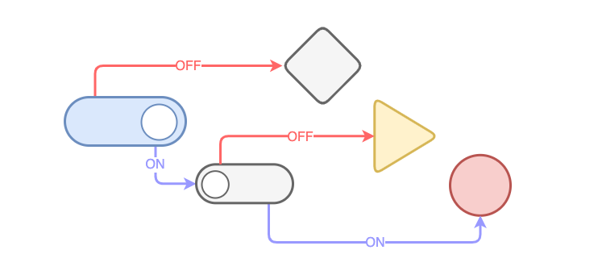
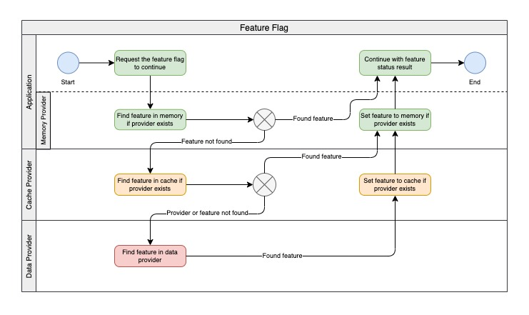

# Feature Flag

This is a node **Feature Flag (Feature Toggle)** module with common data/cache providers like json, mongodb, redis and memcached. If you need another or more complexed provider, feel free to implement it.

<p align="center" width="100%">
    
</p>

If you need more flexibility in your apps, like enable/disable features in production without change environments to deploy manualy or rerun the pipeline, this module is pretty good for you and your team.

It's not only used to turn on or turn off features or test A/B, you can use it to config your app in realtime, getting values from anywere (file, memory, databases, cache, api, realy anywere) to inject in your business logic to change it when you want.

## Why should I use this one instead of create my own or use another?

- Because it's easy to use, small size and you don't need to spend more time to code again.

- Moreover, you can implement your own provider, just extending or implementing some provider or interface.

- With this module, you can using your own infrastructure, like local or cloud databases, very important when your product or company is not so flexibility to explore other services.

## Install

Using npm:

```bash
npm install node-feature-flag
```

Using yarn:

```bash
yarn add node-feature-flag
```

## How to use

Import the FeatureFlag and prepare to load data from some provider

```js
import { FeatureFlag, JsonDataProvider } from "node-feature-flag";

const dataProvider = new JsonDataProvider({ "feature": true });
const featureFlag = new FeatureFlag({ dataProvider });
```

### Check flags

Check the feature status:

```js
const isOn = await featureFlag.isOn("feature");
const isOff = await featureFlag.isOff("feature");
```

Get the feature data, with origin (memory, cache or data):

```js
const data = await featureFlag.get("feature");
console.log(data); // return undefined or feature object
/*
    // print
    {
        key: "feature",
        value: true,
        description: null,
        origin: 'data'
    }
*/
```

Get the feature value:

```js
const value = await featureFlag.getValue("feature");
console.log(data); // return any value
// print true
```

## The possible flow using memory + cache + data providers

<p align="center" width="100%">
    
</p>

## Examples

### Using basic **JSON** data provider

```js
import { FeatureFlag, JsonDataProvider } from "node-feature-flag"; 

(async() => {
    const data = {
        "sign_in": true,
        "sign_in_notification": true,
        "min_age": 18 
    };

    // json data provider
    const dataProvider = new JsonDataProvider({ data });
    const featureFlag = new FeatureFlag({ dataProvider });
    
    if (await featureFlag.isOff("sign_in")) {
        throw new Error("The feature flag sign_in is off");
    }

    const data = await featureFlag.get("min_age")
    if (data && data.value < 18) {
        throw new Error("The min age to sign_in is 18 years");
    }

    if (await featureFlag.isOn("sign_in_notification")) {
        console.info("Notify user about sign_in");
    }

    // continue...
})();
```

### Using **JSON** data provider with memory provider

```js
import { FeatureFlag, MongooseDataProvider, MemoryProvider } from "node-feature-flag"; 
import mongoose from "mongoose";

(async() => {
    // mongoose data provider
    await mongoose.connect("mongodb://localhost:27017/test");
    const dataProvider = new MongooseDataProvider();
    // memory provider
    const memoryProvider = new MemoryProvider({ lifetime: 5 });

    const featureFlag = new FeatureFlag({ dataProvider, memoryProvider });
    
    await featureFlag.isOn('feature'); // get from data provider and load memory
    await featureFlag.isOn('feature'); // get from memory provider
    // after 5seg
    await featureFlag.isOn('feature'); // get from data provider and load memory again

    // continue...
})();
```

If you prefer, you can load all features from data provider to memory.

```js
await feature.loadMemory();
await featureFlag.isOn("feature"); // from memory
await feature.flushMemory(); // reset memory
```

### Using **Mongoose** data provider

```bash
npm install mongoose
```

```js
import { FeatureFlag, MongooseDataProvider } from "node-feature-flag"; 
import mongoose from "mongoose";

(async() => {
    // mongoose data provider
    await mongoose.connect("mongodb://localhost:27017/test");
    const dataProvider = new MongooseDataProvider();

    const featureFlag = new FeatureFlag({ dataProvider });
    
    // continue...
})();
```

### Using **Mongodb** (native drive) data provider

```bash
npm install mongodb
```

```js
import { FeatureFlag, MongodbDataProvider } from "node-feature-flag"; 
import { MongoClient } from "mongodb";

(async() => {
    // mongodb data provider
    const client = new MongoClient("mongodb://localhost:27017/test");
    await client.connect();
    const dataProvider = new MongodbDataProvider({ db: client.db() });

    const featureFlag = new FeatureFlag({ dataProvider });
    
    // continue...
})();
```

### Using **Mongoose** data provider with **Redis** cache provider

```bash
npm install mongoose redis
```

```js
import { 
    FeatureFlag, 
    MongooseDataProvider, 
    RedisCacheProvider 
} from "node-feature-flag"; 
import mongoose from "mongoose";
import { createClient } from "redis";

(async() => {
    // mongoose data provider
    await mongoose.connect("mongodb://localhost:27017/test");
    const dataProvider = new MongooseDataProvider();

    // redis cache provider
    const client = createClient({ url: "redis://localhost:6379" });
    await client.connect();
    const cacheProvider = new RedisCacheProvider({ client, lifetime: 60 });

    const featureFlag = new FeatureFlag({ dataProvider, cacheProvider });
    
    // continue...
})();
```

### Using **Mongodb** (native drive) data provider with **Memcached** cache provider

```bash
npm install mongodb memjs
```

```js
import { 
    FeatureFlag, 
    MongodbDataProvider, 
    MemcachedCacheProvider 
} from "node-feature-flag"; 
import { MongoClient } from "mongodb";
import memjs from "memjs";

(async() => {
    // mongodb data provider
    const client = new MongoClient("mongodb://localhost:27017/test");
    await client.connect();
    const dataProvider = new MongodbDataProvider({ db: client.db() });

    // memcached cache provider
    const client = memjs.Client.create("localhost:11211");
    const cacheProvider = new MemcachedCacheProvider({ client, lifetime: 60 });

    const featureFlag = new FeatureFlag({ dataProvider, cacheProvider });
    
    // continue...
})();
```

### Using **MySQL** data provider

```bash
npm install mysql2
```

```js
import { 
    FeatureFlag, 
    MysqlDataProvider 
} from "node-feature-flag"; 
import { createConnection } from "mysql2";

(async() => {
    // mysql data provider
    const connection = createConnection({
        host: "localhost",
        user: "root",
        password: "root",
        database: "test"
    });
    connection.connect();
    const dataProvider = new MysqlDataProvider({ connection });

    const featureFlag = new FeatureFlag({ dataProvider });
    
    // continue...
})();
```

Example of table: 
```sql 
CREATE TABLE `features` (
  `id` int NOT NULL AUTO_INCREMENT,
  `key` varchar(200) COLLATE utf8mb4_general_ci NOT NULL,
  `value` varchar(1000) COLLATE utf8mb4_general_ci DEFAULT NULL,
  `description` varchar(100) COLLATE utf8mb4_general_ci DEFAULT NULL,
  `created_at` timestamp NULL DEFAULT CURRENT_TIMESTAMP,
  PRIMARY KEY (`id`),
  UNIQUE KEY `features_key_IDX` (`key`) USING BTREE
) ENGINE=InnoDB AUTO_INCREMENT=14 DEFAULT CHARSET=utf8mb4 COLLATE=utf8mb4_general_ci
```

### Using your own data, cache or memory provider implementation

Just create your own class than implements IDataProvider, ICacheProvider or IMemoryProvider and pass to FeatureFlag. 

### Feel free to contribute

- If you find a bug or have a good idea, share with us.

- And if you create a new module to data or cache provider, let us know to add here to help community.

### License

[MIT](LICENSE)